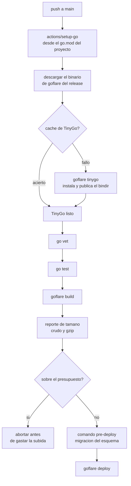

← [Etapa 6](PLAN_STAGE_6_ACTION_AND_RELEASE.md) | Etapa 7 de 7 | Índice: [PLAN.md](PLAN.md)

# Etapa 7 — Documentación

> Esta etapa **verifica y actualiza** documentación contra lo ya implementado.
> Si al escribirla descubres que el código no hace lo que las etapas 1-6 decían,
> el defecto está en el código: arréglalo, no maquilles el documento.

## 1. `README.md`

Sustituye el ejemplo de CI actual por el de una línea:

```yaml
- uses: actions/checkout@v4
- uses: webtyp/goflare@v1
  with:
    worker: mi-worker
    domain: mi-worker.ejemplo.cl
    d1-binding: DB
  env:
    CLOUDFLARE_API_TOKEN: ${{ secrets.CLOUDFLARE_API_TOKEN }}
    CLOUDFLARE_ACCOUNT_ID: ${{ secrets.CLOUDFLARE_ACCOUNT_ID }}
    D1_DATABASE_ID: ${{ secrets.D1_DATABASE_ID }}
```

Añade `size` y `tinygo` a la lista de comandos. Re-indexa la sección de docs
para que **todo** archivo de `docs/` quede enlazado.

## 2. `docs/CI_GITHUB_ACTIONS.md` — reescritura completa

Es el documento que va a leer quien integre goflare. Debe cubrir:

- La tabla completa de inputs, con qué variable de entorno alimenta cada uno.
- Qué es un input y qué es un secreto, y **por qué los secretos nunca son
  inputs** (acaban impresos en los logs de depuración de la action).
- Cómo se resuelve la versión del binario: `version` → `github.action_ref` si es
  un tag semver completo → el literal horneado.
- **El desfase de una versión de `@v1`, explicado**: en el commit del tag
  `vX.Y.Z` el `action.yml` lleva horneado `v(X.Y.Z-1)`, es deliberado, y quien
  necesite la última fija el tag exacto.
- Cómo desplegar solo en `main` y compilar sin desplegar en los PRs
  (`deploy: 'false'`).
- Que `action.yml` es **generado** y que se cambia editando `action_data.go` y
  corriendo `gotest ./...`.

## 3. `docs/BUILD_WORKERS.md` — la sección de tamaño

Documenta los dos umbrales y **sé explícito con el dato que hasta ahora estaba
mal en el código**:

| | Valor | De quién |
|---|---|---|
| Aviso | 256 KiB crudo | presupuesto de goflare |
| Aborto | 900 KiB crudo | presupuesto de goflare |
| Límite real, Free | **3 MB gzip** (64 MB sin comprimir) | Cloudflare |
| Límite real, Paid | 10 MB gzip | Cloudflare |
| Tiempo de arranque | 1 s | Cloudflare (subió de 400 ms en oct-2025) |

Explica por qué los umbrales de goflare se miden sobre el **crudo** aunque el
límite de Cloudflare sea sobre el comprimido: el crudo es lo que el isolate
tiene que parsear e instanciar en cada arranque en frío, y ése es el recurso
escaso, no el ancho de banda de la subida.

Documenta `WASM_WARN_SIZE_KIB` y `WASM_MAX_SIZE_KIB`, y que un `0` desactiva su
umbral.

## 4. `docs/ARCHITECTURE.md`

Una sección nueva: **"Un binario, no un módulo"**. Debe dejar escrito el
razonamiento, porque es la decisión que estructura todo el repo:

- goflare se consume como **binario publicado**, no como dependencia de `go.mod`
  del proyecto. Un proyecto que despliega no debería compilar un redimensionador
  de imágenes.
- Medido: compilar goflare desde fuente cuesta 18 s en frío en una máquina de
  desarrollo rápida (40-70 s en un runner); descargar el binario publicado,
  1-2 s. Y la caché de `actions/setup-go` está clavada a `go.sum`, que en este
  ecosistema rota en el 43 % de los commits.
- El binario instala TinyGo por su cuenta, así que hay **una sola fuente** de esa
  versión.
- Precio de la decisión: el pegamento JS embebido y el runtime Go compilado
  pueden divergir. Por eso existe la guarda de la
  [etapa 4](PLAN_STAGE_4_VERSION_SKEW.md), y documenta el fallo que previene —
  un Worker que aborta al inicializar paquetes, sin mensaje.

## 5. `docs/diagrams/DEPLOY_FLOW.md`

Actualiza el diagrama al camino nuevo. `flowchart TD`, sin `subgraph`, `<br/>`
para saltos de línea.



## 6. `AGENTS.md`

Añade a la tabla de "Two build targets" una fila para `actiongen/`: **solo
stdlib, sin dependencias del ecosistema**, porque está pensado para extraerse a
su propio repo. Y una nota de que `action.yml` es generado y no se edita a mano.

## 7. Borra lo que quedó obsoleto

- Toda mención a "Cloudflare Free limit: 1 MiB" en cualquier `.md`.
- Toda instrucción de CI que diga `go run webtyp.com/goflare/cmd/goflare`.
- Toda mención a instalar TinyGo como paso separado del workflow.

`grep -rn "1 MiB\|go run webtyp.com/goflare" docs/ README.md` → vacío.

## Criterios de aceptación

- Todo archivo de `docs/` está enlazado desde `README.md`.
- `grep -rn "PLAN.md\|PLAN_STAGE" README.md docs/ARCHITECTURE.md docs/CI_GITHUB_ACTIONS.md docs/BUILD_WORKERS.md` → **vacío**. Los documentos permanentes nunca citan un plan: `codejob` borra `docs/PLAN.md` al publicar y toda referencia queda muerta.
- El diagrama renderiza (sin `subgraph`, sin `\n` crudos dentro de nodos).
