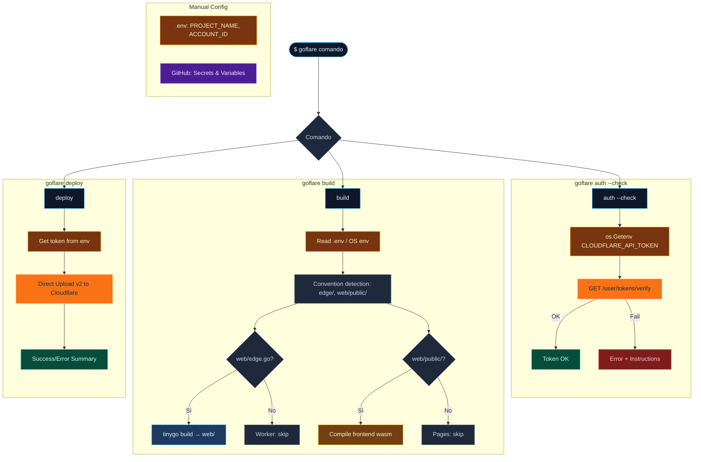

```mermaid
flowchart TD
    classDef cmd fill:#0f172a,stroke:#38bdf8,color:#e0f2fe
    classDef detect fill:#1e293b,stroke:#94a3b8,color:#cbd5e1
    classDef compile fill:#1e3a5f,stroke:#38bdf8,color:#e0f2fe
    classDef front fill:#713f12,stroke:#facc15,color:#fef9c3
    classDef output fill:#064e3b,stroke:#34d399,color:#d1fae5
    classDef auth fill:#4c1d95,stroke:#a78bfa,color:#ede9fe
    classDef error fill:#7f1d1d,stroke:#f87171,color:#fecaca
    classDef cf fill:#f97316,stroke:#fdba74,color:#1e293b
    classDef env fill:#78350f,stroke:#f59e0b,color:#fef3c7

    USER(["$ goflare comando"]):::cmd
    USER --> CMD_SWITCH{"Comando"}:::detect
    CMD_SWITCH --> CMD_AUTH["auth --check"]:::cmd
    CMD_SWITCH --> CMD_BUILD["build"]:::cmd
    CMD_SWITCH --> CMD_DEPLOY["deploy"]:::cmd

    %% GOFLARE AUTH
    subgraph AUTH ["goflare auth --check"]
        direction TB
        CMD_AUTH --> READ_TOKEN["os.Getenv CLOUDFLARE_API_TOKEN"]:::env
        READ_TOKEN --> VALIDATE["GET /user/tokens/verify"]:::cf
        VALIDATE -->|OK| AUTH_OK["Token OK"]:::output
        VALIDATE -->|Fail| AUTH_ERR["Error + Instructions"]:::error
    end

    %% GOFLARE BUILD
    subgraph BUILD ["goflare build"]
        direction TB
        CMD_BUILD --> READ_ENV_B["Read .env / OS env"]:::env
        READ_ENV_B --> DETECT["Convention detection: edge/, web/public/"]:::detect

        DETECT --> HAS_BACK{"web/edge.go?"}:::detect
        HAS_BACK -->|Sí| TINYGO["tinygo build → web/"]:::compile
        HAS_BACK -->|No| SKIP_W["Worker: skip"]:::detect

        DETECT --> HAS_FRONT{"web/public/?"}:::detect
        HAS_FRONT -->|Sí| FRONT_WASM["Compile frontend wasm"]:::front
        HAS_FRONT -->|No| SKIP_P["Pages: skip"]:::detect
    end

    %% GOFLARE DEPLOY
    subgraph DEPLOY ["goflare deploy"]
        direction TB
        CMD_DEPLOY --> D_AUTH["Get token from env"]:::env
        D_AUTH --> D_PUSH["Direct Upload v2 to Cloudflare"]:::cf
        D_PUSH --> D_RESULT["Success/Error Summary"]:::output
    end

    subgraph CONFIG ["Manual Config"]
        direction LR
        C_ENV[".env: PROJECT_NAME, ACCOUNT_ID"]:::env
        C_GH["GitHub: Secrets & Variables"]:::auth
    end
```
